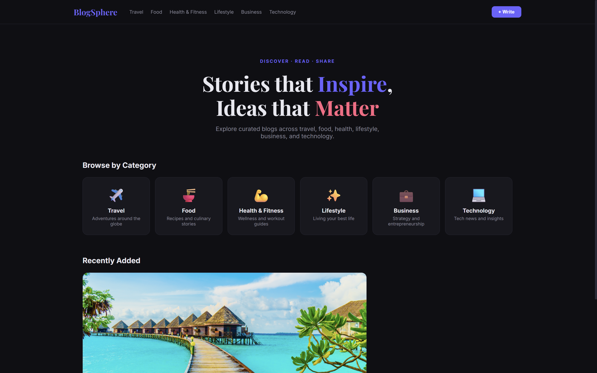
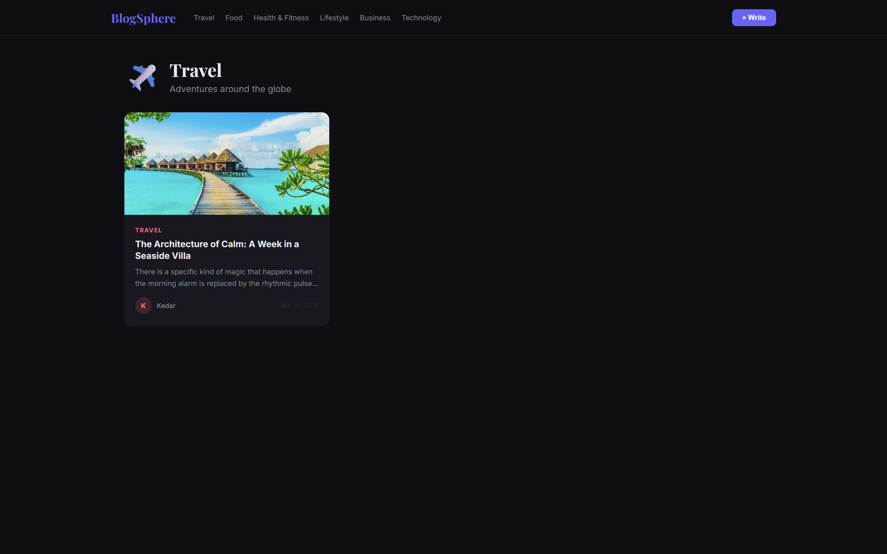
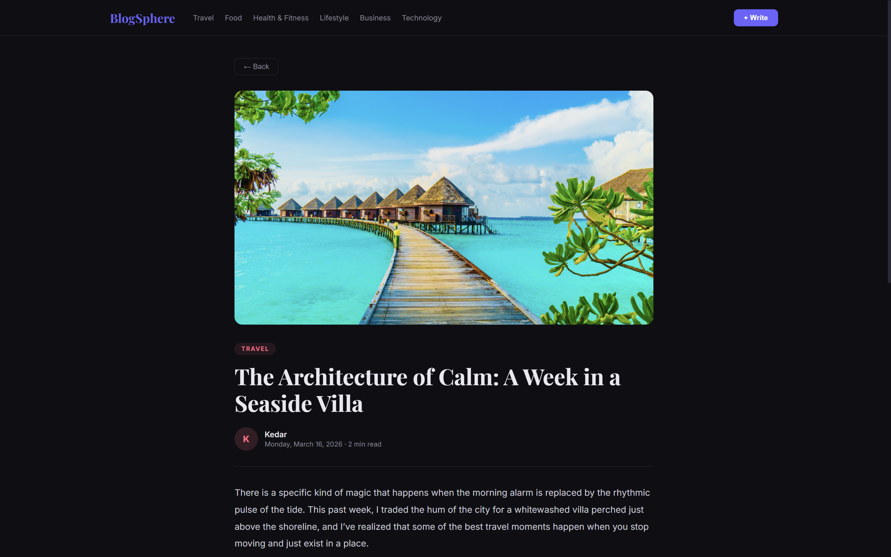
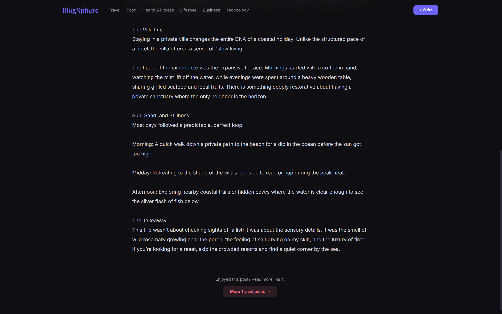
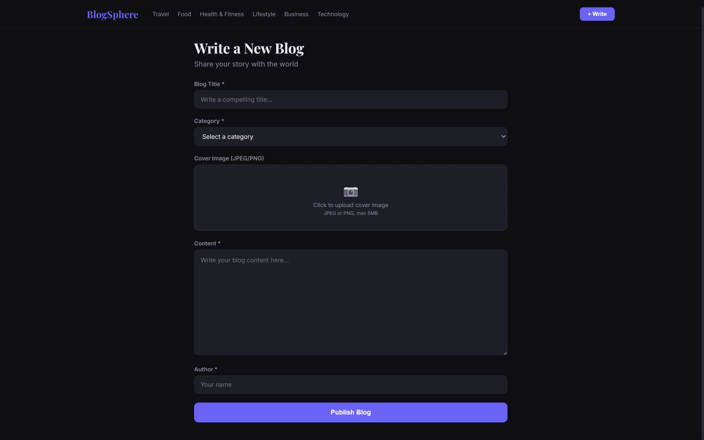

# 📰 BlogSphere
 
A full-stack blog application with categories, cover images, and a beautiful dark UI — deployable on a local Kubernetes cluster.
 
---

---

---

---

---

---

## 🗂 Project Structure

```
blog-app/
├── backend
│   ├── Dockerfile
│   ├── models
│   │   └── Blog.js
│   ├── package.json
│   └── server.js
├── frontend
│   ├── Dockerfile
│   ├── index.html
│   ├── nginx.conf
│   ├── package.json
│   ├── vite.config.js
│   ├── public
│   │   └── index.html
│   ├── src
│   │   ├── App.jsx
│   │   ├── components
│   │   │   ├── BlogCard.jsx
│   │   │   ├── CategoryCard.jsx
│   │   │   └── Navbar.jsx
│   │   ├── index.css
│   │   ├── main.jsx
│   │   └── pages
│   │       ├── BlogDetail.jsx
│   │       ├── CategoryPage.jsx
│   │       ├── CreateBlog.jsx
│   │       └── Home.jsx
├── k8s-manifests
│   ├── backend-deployment.yaml
│   ├── backend-hpa.yaml
│   ├── backend-svc.yaml
│   ├── config-map.yaml
│   ├── frontend-deployment.yaml
│   ├── frontend-svc.yaml
│   ├── ingress.yaml
│   ├── mondodb-deployment.yaml
│   ├── mongodb-svc.yaml
│   ├── namespace.yaml
│   └── pvc.yaml
└── README.md

```

---

## 🔌 API Endpoints
 
| Method | Endpoint         | Description                               |
|--------|------------------|-------------------------------------------|
| GET    | `/api/health`    | Health check                              |
| GET    | `/api/blogs`     | List all blogs (`?category=Food&limit=7`) |
| GET    | `/api/blogs/:id` | Get single blog                           |
| GET    | `/api/image/:id` | Get blog cover image                      |
| POST   | `/api/blogs`     | Create blog (multipart/form-data)         |
| DELETE | `/api/blogs/:id` | Delete blog                               |
 
---

## 📦 Tech Stack


| Layer         | Technology                                               |
|---------------|----------------------------------------------------------|
| Frontend      | React 18, Vite, React Router v6                          |
| Backend       | Node.js, Express 4, Multer                               | 
| Database      | MongoDB 7 (images stored as BSON binary)                 |
| Container     | Docker (multi-stage build )                              |
| Web server    | Nginx (reverse proxy + SPA routing)                      |
| Orchestration | Kubernetes (Deployment, Service, PVC, HPA, Ingress)      |

---

### Forwarding the port for frontend
kubectl port-forward svc/blog-frontend 9094:80 -n blog-app > /dev/null 2>&1 &


## 🧹 Cleanup

```bash
kubectl delete namespace blog-app
```
This removes all resources including the MongoDB PVC.
---

